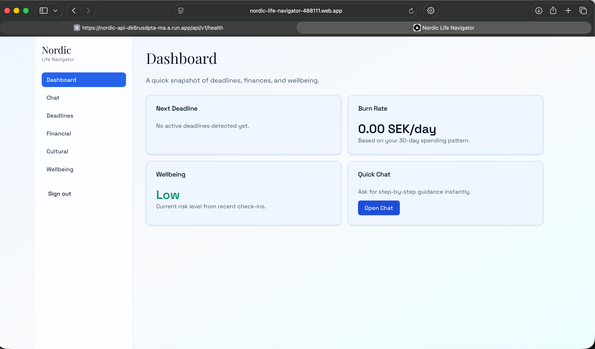
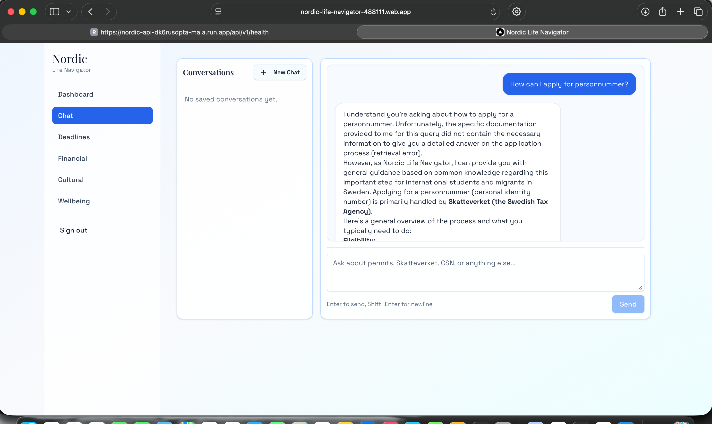

# Nordic Life Navigator

Nordic Life Navigator is an AI-powered platform that helps international students and migrants navigate Swedish life across bureaucracy, deadlines, personal finance, wellbeing, and communication style.

## Live Deployment

- Frontend (Firebase Hosting): `https://nordic-life-navigator-488111.web.app`
- Backend API (Cloud Run): `https://nordic-api-dk6rusdpta-ma.a.run.app`
- Health check: `https://nordic-api-dk6rusdpta-ma.a.run.app/api/v1/health`

## Screenshots

Place screenshots in `docs/screenshots/` with the filenames below.




## What I Implemented

### 1) AI Bureaucracy Assistant
- Built a streaming chat assistant for Swedish bureaucracy workflows.
- Implemented retrieval-augmented generation (RAG) with curated government sources.
- Added context-aware responses for permits, tax, registration, and student support topics.

### 2) Deadline Tracking
- Extracted deadlines from user messages.
- Tracked due dates and urgency status.
- Exposed dashboard-ready summary APIs.

### 3) Financial Planning
- Implemented financial profile, expense, recurring expense, income, and forecast models.
- Added burn-rate and runway analytics for daily decision support.
- Built visual components for spending breakdown and forecast trends.

### 4) Wellbeing Support
- Added wellbeing scoring and risk-level classification.
- Exposed safety-oriented summary endpoints for UI cards and alerts.

### 5) Cultural Interpretation Module
- Added a dedicated cultural API module for Swedish communication norms.
- Implemented:
  - message analysis endpoint,
  - rewrite endpoint,
  - service-level JSON parsing and model error handling,
  - unit tests for success and failure paths.

### 6) Full Frontend Application (Next.js 14)
- Built authenticated app routes for:
  - Dashboard
  - Chat
  - Deadlines
  - Financial
  - Cultural
  - Wellbeing
- Integrated Firebase Auth and API token forwarding.
- Added SSE chat streaming and state management for active conversations.

### 7) Deployment + DevOps
- Deployed backend to Cloud Run.
- Deployed frontend to Firebase Hosting.
- Added GitHub Actions workflows for CI and deployments.
- Added Docker Compose and Makefile commands for local development.

## Architecture

- Frontend: Next.js 14, TypeScript, Tailwind, shadcn/ui, React Query, Recharts
- Backend: FastAPI, SQLAlchemy, Celery
- AI: Gemini model integration + RAG
- Data: Postgres (Cloud SQL in prod), SQLite (local), ChromaDB for vector retrieval
- Auth: Firebase Authentication (ID token verification in backend)

## Implementation Journey

1. Built and validated backend modules first (APIs, services, schemas, tests).
2. Added Alembic migration support for reliable schema lifecycle management.
3. Added local infrastructure (`docker-compose`, `Makefile`, env templates, seed script).
4. Built frontend pages and integrated them with authenticated backend endpoints.
5. Added deployment workflows for Cloud Run and Firebase Hosting.
6. Iterated on production fixes:
   - CORS alignment between frontend and API,
   - Gemini model naming/availability handling,
   - Firebase token/project alignment issues.

## Local Setup

### Prerequisites

- Docker Desktop
- Node.js 20+
- Python 3.12+

### Start Full Stack

```bash
make dev
```

Frontend (separate terminal):

```bash
cd frontend
npm install
npm run dev
```

Backend tests:

```bash
cd backend
PYTHONPATH=. pytest tests/unit/ -v
```

## Environment Variables (No Secrets in Git)

Use local env files and secret managers. Do not hardcode credentials in source files.

- `backend/.env` for backend local variables (ignored by git)
- `frontend/.env.local` for frontend local variables (ignored by git)
- GitHub Actions secrets for CI/CD deployment
- Cloud Run/Firebase environment configuration for production

Template files:

- `backend/.env.example`
- `frontend/.env.local.example`

## Secure Credential Handling

This repository is configured to prevent accidental credential commits:

- Ignored secret files:
  - `backend/serviceAccountKey.json`
  - `backend/.env`
  - `frontend/.env.local`
  - `frontend/.env.*.local`
- Deployment secrets are referenced through GitHub Actions secrets and Cloud Run env settings.
- If any key/token was ever shared publicly, rotate it immediately in:
  - Google Cloud Console
  - Firebase Console
  - GitHub Secrets

## Deployment Notes

### Backend (Cloud Run)

```bash
gcloud run deploy nordic-api \
  --image gcr.io/<PROJECT_ID>/nordic-api:latest \
  --region europe-north2 \
  --platform managed \
  --allow-unauthenticated \
  --add-cloudsql-instances <PROJECT_ID>:europe-north2:<INSTANCE_NAME> \
  --update-env-vars "DATABASE_URL=<DATABASE_URL>,GEMINI_API_KEY=<GEMINI_API_KEY>,GEMINI_MODEL=gemini-2.5-flash,FIREBASE_PROJECT_ID=<PROJECT_ID>"
```

### Frontend (Firebase Hosting)

```bash
cd frontend
npm ci
npm run build
firebase deploy --only hosting --project <PROJECT_ID>
```

## CI/CD

- Backend deploy workflow: `.github/workflows/deploy-api.yml`
- Frontend deploy workflow: `.github/workflows/deploy-web.yml`
- Worker deploy workflow: `.github/workflows/deploy-worker.yml`
- Migration workflow: `.github/workflows/migrate.yml`

## License

MIT (or project default)
